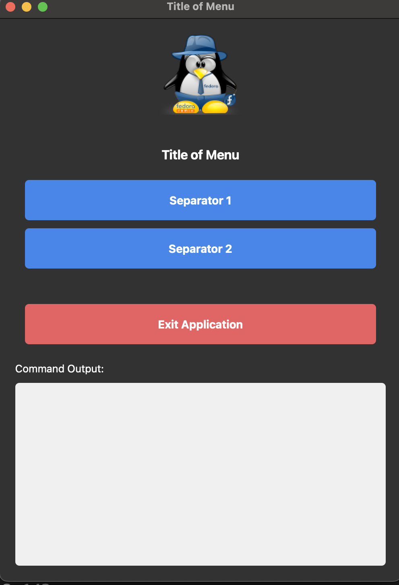
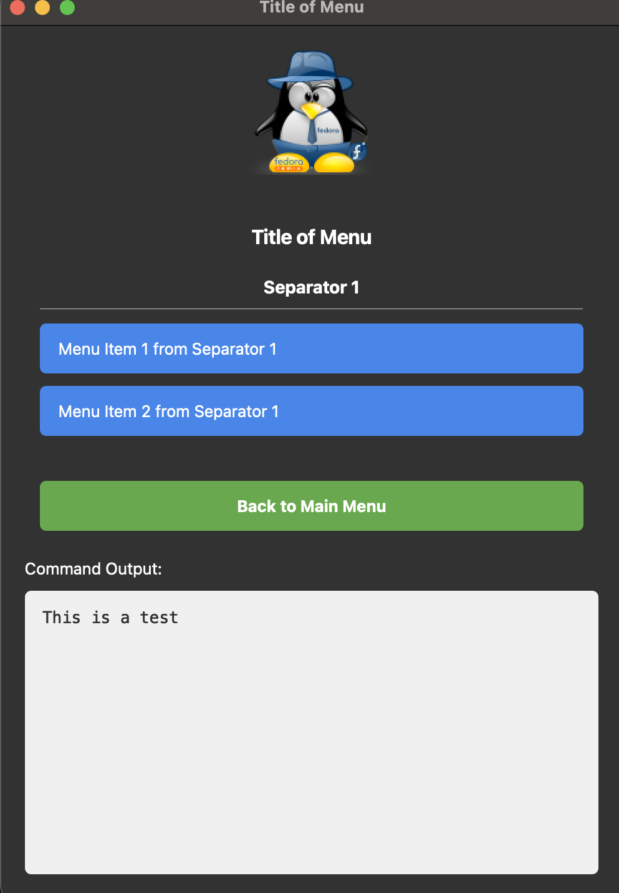

# Fedora Remix Tools

Fedora Remix Tools is the next evolution of the YAD Fedora Remix Scripts. This set of tools is meant to replace the "YAD" interface and BASH scripts with a Qt5 Python application for launching and controlling the Remix Tools and applications. The new method is capable of being configured entirely with the **config.yml** file and will take and accept changes on the next launch of the application.


## Python_GUI_Menu - Comes from Python Project

Python Generic GUI Menu Creator. This uses the **config.yml** to create a dynamic application.

````
icon: smallicon.png
logo: logo.png
menu_title: Title of Menu
menu_items:
  - name: Separator 1
    items:
      - name: Menu Item 1 from Separator 1
        command: ls -alF | grep travis
      - name: Menu Item 2 from Separator 1
        command: echo "This is a test"
  - name: Separator 2
    items:
      - name: Menu Item 1 from Separator 2
        command: echo "This is another test"
````






## Creating the Virtual Environment and Running the Menu

````
uv venv menu_venv --python=3.12
source menu_venv/bin/activate
uv pip install PyQt5 PyYaml
python menu.py
````

## RPM Building

mkdir -p ~/rpmbuild/{SPECS,SOURCES}
cp config.yml menu.py logo.png smallicon.png RHCI.desktop ~/rpmbuild/SOURCES

rpmbuild -ba ~/rpmbuild/SPECS/rhci_foundation.spec
